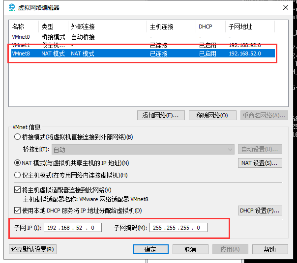
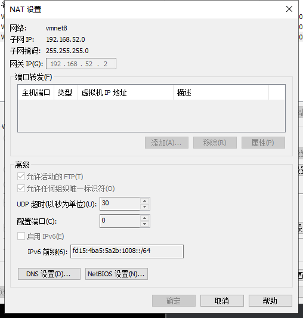
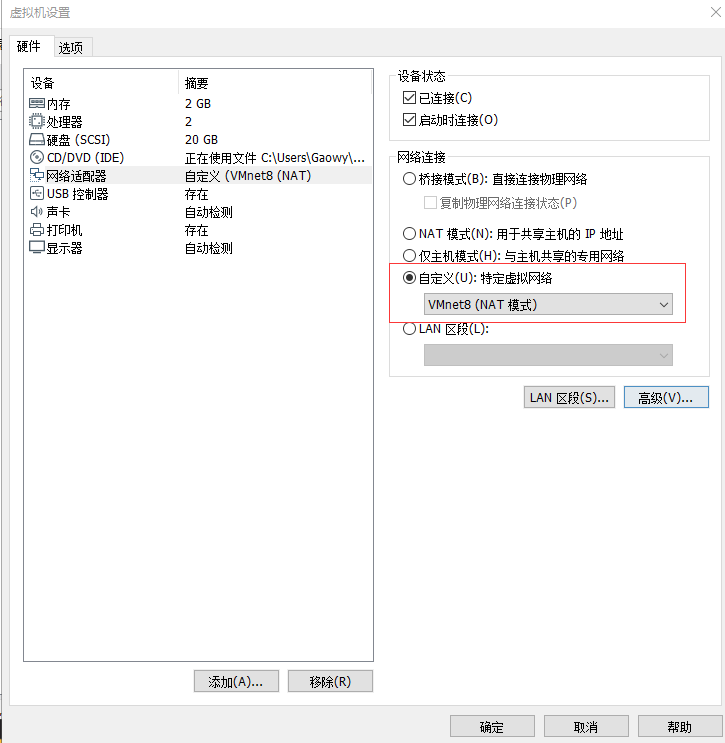

# 大数据之 Hadoop 环境准备

1. [文档说明](#文档说明)
1. [VmWare与Linux版本](#VmWare与Linux版本)
    * [VmWare版本](#VmWare版本)
    * [Linux版本](#Linux版本)
1. [使用VmWare来安装Linux](#使用VmWare来安装Linux)
1. [Linux服务器环境准备](#Linux服务器环境准备)
    * [配置网络](#配置网络)
    * [Xshell连接配置](#Xshell连接配置)
    * [关闭防火墙](#关闭防火墙)
    * [关闭selinux](#关闭selinux)
    * [更改主机名](#更改主机名)
    * [建立映射节点](#建立映射节点)
    * [添加普通用户并授权](#添加普通用户并授权)
    * [上传并解压Hadoop、JDK安装文件](#上传并解压Hadoop、JDK安装文件)

## 文档说明

我们在虚拟机上运行 Linux 操作系统，来构建大数据学习的基本软件环境。本文档会说明我们使用的虚拟机和操作系统版本，以及大数据环境搭建的前置准备。

## VmWare与Linux版本

### VmWare版本

VmWare Workstation Pro，版本不做要求，使用 VmWare 10 版本以上即可，关于 VmWare 的安装，直接使用安装包一直下一步安装即可。

### Linux版本

Linux 使用 CentOS 7.6 64位版本。

## 使用VmWare来安装Linux

略。

## Linux服务器环境准备

我们使用三台 Linux 服务器，来做统一的环境准备：

* 第一台机器主机名为 node1，IP 地址为 192.168.52.100
* 第二台机器主机名为 node2，IP 地址为 192.168.52.110
* 第三台机器主机名为 node3，IP 地址为 192.168.52.120

### 配置网络

修改 IP 地址，第一台机器 IP 地址为 192.168.52.100

```shell
vi /etc/sysconfig/network-scripts/ifcfg-ens33 

BOOTPROTO=static #修改
ONBOOT=yes #修改
IPADDR=192.168.52.100
NETMASK=255.255.255.0
GATEWAY=192.168.52.2
DNS1=8.8.8.8
```
使用 `service network restart `命令，重启网络服务。

#### 编辑VMware虚拟网络配饰器







## Xshell连接配置

 xshell可能遇到的问题：

* **警告**：

> Warring The remote SSH server rejected X11 forwarding request

解决办法：隧道->“转发x11连接到”取消勾选


* **xshell卡在下面提示中时间过长**

> To escape to local shell, press 'Ctrl+Alt+]'.

解决办法：

```shell
vi /etc/ssh/sshd_config 
// 找到 #UseDns yes 把yes改为 no
service sshd restart #刷新ssh配置
```

### 关闭防火墙

在 root 用户下执行以下命令关闭防火墙

```shell
systemctl stop firewalld #关闭防火墙
systemctl disable firewalld #防火墙不在启动
systemctl status firewalld #查看防火墙状态
// 显示下列信息即为关闭
● firewalld.service - firewalld - dynamic firewall daemon
   Loaded: loaded (/usr/lib/systemd/system/firewalld.service; disabled; vendor preset: enabled)
   Active: inactive (dead)
     Docs: man:firewalld(1)
```

### 关闭selinux

在 root 用户下执行以下命令关闭 selinux

```shell
yum install -y vim #安装vim
vim /etc/selinux/config #进入selinux设置文件

SELINUX=disabled
```

### 更改主机名

第一台机器执行以下命令修改主机名

```shell
vim /etc/hostname
node01
```

或者使用命令

```shell
hostnamectl set-hostname node01
```

### 建立映射节点

执行以下命令更改主机名与 IP 地址映射关系

```shell
vim /etc/hosts

192.168.52.100  node01
192.168.52.110  node02
192.168.52.120  node03
```

### 克隆另外两台机器

使用虚拟机的克隆功能，克隆出与第一台机器 node1 完成相同另外两台机器 node2 和 node3，再配置 node2 和 node3 的网络，更改它们的主机名。参考上述<a>配置网络</a>和<a>更改主机名</a>两个步骤。

* 第二台机器主机名为 node2，IP 地址为 192.168.52.110
* 第三台机器主机名为 node3，IP 地址为 192.168.52.120

### 三台机器同步时间

三台机器执行以下命令定时同步阿里云服务器时间

```shell
yum -y install ntpdate
crontab -e 
*/1 * * * * /usr/sbin/ntpdate time1.aliyun.com
```

### 添加普通用户并授权

三台 Linux 服务器统一添加普通用户 hadoop，并给以 sudo 权限。

```shell
useradd hadoop #添加hadoop用户
passwd hadoop #给hadoop用户添加密码
```

给 hadoop 用户添加所有权限

```shell
visudo #进入用户权限配置文件
## Allow root to run any commands anywhere
root    ALL=(ALL)       ALL
hadoop  ALL=(ALL)       ALL
```

### 上传并解压Hadoop、JDK安装文件

三台机器定义统一的软件压缩包存放目录，以及解压后的安装目录。

```shell
cd /	# 先进入根目录
mkdir -p /bigdata/soft     # 软件压缩包存放目录
mkdir -p /bigdata/install  # 软件解压后存放目录
chown -R hadoop:hadoop /kkb    # root用户将文件夹权限更改为hadoop用户

#将jdk8-linux压缩包，zookeeper压缩包，hadoop压缩包，通过xftp传送到/bigdata/soft/目录
cd /kkb/soft
# 解压jdk到/kkb/install文件夹
tar -zxvf jdk-8u141-linux-x64.tar.gz  -C /bigdata/install/ 
# 解压hadoop到/kkb/install文件夹
tar -zxvf hadoop-2.6.0-cdh5.14.2_after_compile.tar.gz  -C /bigdata/install/ 
```

### 三台机器安装jdk

==使用hadoop用户来重新连接三台机器，然后使用hadoop用户来安装jdk软件==

上传压缩包到第一台服务器的/kkb/soft下面，然后进行解压，配置环境变量即可，三台机器都依次安装即可

```
cd /kkb/soft/

tar -zxf jdk-8u181-linux-x64.tar.gz  -C /kkb/install/
sudo vim /etc/profile


#添加以下配置内容，配置jdk环境变量
export JAVA_HOME=/kkb/install/jdk1.8.0_141
export PATH=:$JAVA_HOME/bin:$PATH
```

source /etc/profile
 java -version
问题 ：
Linux下环境变量配置错误 导致大部分命令不可以使用的解决办法
直接解决方法：在命令行中输入：export PATH=/usr/bin:/usr/sbin:/bin:/sbin:/usr/X11R6/bin 后 Enter

### hadoop用户免密码登录

三台机器在hadoop用户下执行以下命令生成公钥与私钥比

```
ssh-keygen -t rsa 
三台机器在hadoop用户下，执行以下命令将公钥拷贝到node01服务器上面去
ssh-copy-id  node01
node01在hadoop用户下，执行以下命令，将authorized_keys拷贝到node02与node03服务器
cd /home/hadoop/.ssh/
scp authorized_keys  node02:$PWD
scp authorized_keys  node03:$PWD
```


### 三台机器关机重启

三台机器在root用户下执行以下命令，实现关机重启

```
init 6
```


## 五、三台机器安装zookeeper集群

注意事项：==三台机器一定要保证时钟同步==

### 第一步：下载zookeeeper的压缩包，下载网址如下

http://archive.cloudera.com/cdh5/cdh/5/

我们在这个网址下载我们使用的zk版本为[zookeeper-3.4.5-cdh5.14.2.tar.gz](http://archive.cloudera.com/cdh5/cdh/5/zookeeper-3.4.5-cdh5.14.2.tar.gz)

下载完成之后，上传到我们的node01的/kkb/soft路径下准备进行安装

### 第二步：解压

node01执行以下命令解压zookeeper的压缩包到node01服务器的/kkb/install路径下去，然后准备进行安装

```
cd /kkb/soft

tar -zxvf zookeeper-3.4.5-cdh5.14.2.tar.gz  -C /kkb/install/
```


### 第三步：修改配置文件

第一台机器修改配置文件

```
cd /kkb/install/zookeeper-3.4.5-cdh5.14.2/conf

cp zoo_sample.cfg zoo.cfg

mkdir -p /kkb/install/zookeeper-3.4.5-cdh5.14.2/zkdatas

vim  zoo.cfg

dataDir=/kkb/install/zookeeper-3.4.5-cdh5.14.2/zkdatas

autopurge.snapRetainCount=3

autopurge.purgeInterval=1

server.1=node01:2888:3888

server.2=node02:2888:3888

server.3=node03:2888:3888
```

 

### 第四步：添加myid配置

在第一台机器的/kkb/install/zookeeper-3.4.5-cdh5.14.2/zkdatas/

这个路径下创建一个文件，文件名为myid ,文件内容为1

 

```
echo 1 >  /kkb/install/zookeeper-3.4.5-cdh5.14.2/zkdatas/myid
```

 

### 第五步：安装包分发并修改myid的值

安装包分发到其他机器

```
第一台机器上面执行以下两个命令

scp -r /kkb/install/zookeeper-3.4.5-cdh5.14.2/ node02:/kkb/install/

scp -r /kkb/install/zookeeper-3.4.5-cdh5.14.2/ node03:/kkb/install/

第二台机器上修改myid的值为2

直接在第二台机器任意路径执行以下命令

echo 2 > /kkb/install/zookeeper-3.4.5-cdh5.14.2/zkdatas/myid

 

第三台机器上修改myid的值为3

直接在第三台机器任意路径执行以下命令

echo 3 > /kkb/install/zookeeper-3.4.5-cdh5.14.2/zkdatas/myid
```

 

### 第六步：三台机器启动zookeeper服务

三台机器启动zookeeper服务

这个命令三台机器都要执行

```
/kkb/install/zookeeper-3.4.5-cdh5.14.2/ bin/zkServer.sh start

查看启动状态

/kkb/install/zookeeper-3.4.5-cdh5.14.2/ bin/zkServer.sh status
```