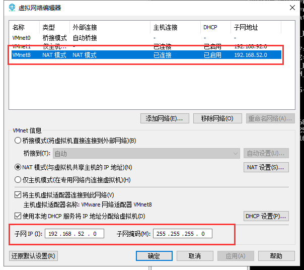
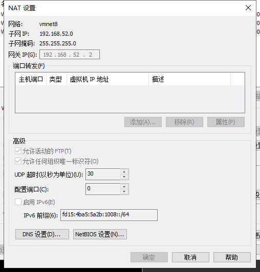
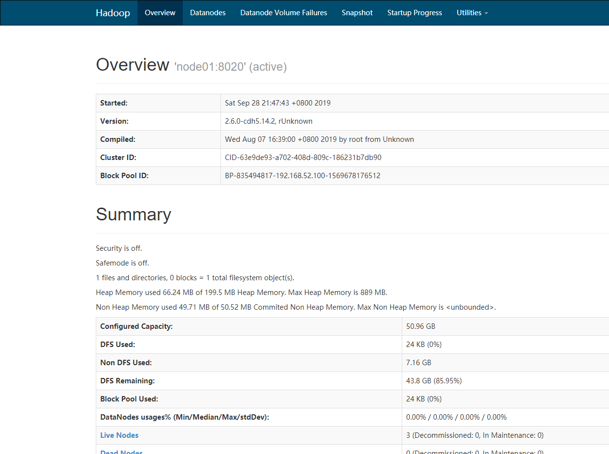

# 大数据之 Hadoop 环境搭建

1. [文档说明](#文档说明)
1. [VmWare 与 Linux 版本](#VmWare与Linux版本)
	* [VmWare 版本](#VmWare版本)
	* [Linux 版本](#Linux版本)
1. [使用 VmWare 来安装 Linux](#使用VmWare来安装Linux)
1. [Hadoop 环境搭建](#Hadoop环境搭建)
	* [配置网络](#配置网络)
	* [Xshell 连接配置](#Xshell连接配置)
	* [关闭防火墙](#关闭防火墙)
	* [关闭 selinux](#关闭selinux)
	* [更改主机名](#更改主机名)
	* [建立映射节点](#建立映射节点)
	* [同步时间](#同步时间)
	* [添加普通用户并授权](#添加普通用户并授权)
	* [上传并解压 Hadoop 和 JDK 安装文件](#上传并解压Hadoop和JDK安装文件)
	* [配置 JDK 和 Hadoop 环境变量](#配置JDK和Hadoop环境变量)
	* [配置 hadoop-env.sh](#配置hadoop-env)
	* [配置 core-site.xml](#配置core-site)
	* [配置 hdfs-site.xml](#配置hdfs-site)
	* [配置 mapred-site.xml](#配置mapred-site)
	* [配置 yarn-site.xml](#配置yarn-site)
	* [编辑 slaves](#编辑slaves)
	* [创建Hadoop数据存放目录](#创建Hadoop数据存放目录)
	* [克隆](#克隆)
	* [Hadoop 用户免密码登录](#Hadoop用户免密码登录)
	* [格式化 Hadoop 并启动集群](#格式化Hadoop并启动集群)
	* [验证 Hadoop 集群是否启动成功](#验证Hadoop集群是否启动成功)
	* [遇到权限不够](#遇到权限不够)


## 文档说明

我们在虚拟机上运行 Linux 操作系统，来构建大数据学习的基本软件环境。本文档会说明我们使用的虚拟机和操作系统版本，以及大数据环境搭建的前置准备。

## VmWare与Linux版本

### VmWare版本

VmWare Workstation Pro，版本不做要求，使用 VmWare 10 版本以上即可，关于 VmWare 的安装，直接使用安装包一直下一步安装即可。

### Linux版本

Linux 使用 CentOS 7.6 64位版本。

## 使用VmWare来安装Linux

略。

## Hadoop环境搭建

我们使用三台 Linux 服务器，来做统一的环境准备：

* 第一台机器主机名为 node1，IP 地址为 192.168.52.100
* 第二台机器主机名为 node2，IP 地址为 192.168.52.110
* 第三台机器主机名为 node3，IP 地址为 192.168.52.120

### 配置网络

修改 IP 地址，第一台机器 IP 地址为 192.168.52.100

```shell
vi /etc/sysconfig/network-scripts/ifcfg-ens33 

BOOTPROTO=static # 修改
ONBOOT=yes # 修改
IPADDR=192.168.52.100
NETMASK=255.255.255.0
GATEWAY=192.168.52.2
DNS1=8.8.8.8
```
使用 `service network restart `命令，重启网络服务。

#### 编辑VMware虚拟网络配饰器






## Xshell连接配置

 xshell可能遇到的问题：

* **警告**：

> Warring The remote SSH server rejected X11 forwarding request

解决办法：隧道->“转发x11连接到”取消勾选


* **xshell卡在下面提示中时间过长**

> To escape to local shell, press 'Ctrl+Alt+]'.

解决办法：

```shell
vi /etc/ssh/sshd_config 
# 找到 #UseDns yes，把yes改为no
service sshd restart # 刷新ssh配置
```

### 关闭防火墙

在 root 用户下执行以下命令关闭防火墙

```shell
systemctl stop firewalld # 关闭防火墙
systemctl disable firewalld # 防火墙不在启动
systemctl status firewalld # 查看防火墙状态
# 显示下列信息即为关闭
● firewalld.service - firewalld - dynamic firewall daemon
   Loaded: loaded (/usr/lib/systemd/system/firewalld.service; disabled; vendor preset: enabled)
   Active: inactive (dead)
     Docs: man:firewalld(1)
```

### 关闭selinux

在 root 用户下执行以下命令关闭 selinux

```shell
yum install -y vim # 安装vim
vim /etc/selinux/config # 进入selinux设置文件

SELINUX=disabled
```

### 更改主机名

第一台机器执行以下命令修改主机名

```shell
vim /etc/hostname
node01
```

或者使用命令

```shell
hostnamectl set-hostname node01
```

### 建立映射节点

执行以下命令更改主机名与 IP 地址映射关系

```shell
vim /etc/hosts

192.168.52.100  node01
192.168.52.110  node02
192.168.52.120  node03
```

### 同步时间

执行以下命令定时同步阿里云服务器时间

```shell
yum -y install ntpdate
crontab -e 
*/1 * * * * /usr/sbin/ntpdate time1.aliyun.com
```

### 添加普通用户并授权

三台 Linux 服务器统一添加普通用户 hadoop，并给以 sudo 权限。

```shell
useradd hadoop # 添加hadoop用户
passwd hadoop # 给hadoop用户添加密码
```

给 hadoop 用户添加所有权限

```shell
visudo # 进入用户权限配置文件
# Allow root to run any commands anywhere
root    ALL=(ALL)       ALL
hadoop  ALL=(ALL)       ALL
```

### 上传并解压Hadoop和JDK安装文件

三台机器定义统一的软件压缩包存放目录，以及解压后的安装目录。

* Hadoop版本：hadoop-2.6.0-cdh5.14.2_after_compile.tar.gz
* JDK版本：jdk-8u141-linux-x64.tar.gz

在 root 用户下执行以下命令
```shell
cd /	# 先进入根目录
mkdir -p /bigdata/soft     # 软件压缩包存放目录
mkdir -p /bigdata/install  # 软件解压后存放目录
chown -R hadoop:hadoop /bigdata    # 在root用户下将文件夹权限更改为hadoop用户

#将jdk8-linux压缩包，hadoop压缩包，通过lrzsz传送到/bigdata/soft/目录
yum install lrzsz #安装
rz #上传文件

cd /bigdata/soft
# 解压jdk到/bigdata/install文件夹
tar -zxvf jdk-8u141-linux-x64.tar.gz  -C /bigdata/install/ 
# 解压hadoop到/bigdata/install文件夹
tar -zxvf hadoop-2.6.0-cdh5.14.2_after_compile.tar.gz  -C /bigdata/install/ 
```

### 配置JDK和Hadoop环境变量

```shell
rpm -e --nodeps # 删除原生jdk
vim /etc/profile # 配置全局全局环境变量,下拉到文件最下方
export JAVA_HOME=/bigdata/install/jdk1.8.0_141  #添加
export HADOOP_HOME=/bigdata/install/hadoop-2.6.0-cdh5.14.2 # 添加
export PATH=$PATH:$HOME/bin:$JAVA_HOME/bin:$HADOOP_HOME/bin:$HADOOP_HOME/sbin # 添加

source /etc/profile # 环境变量立即生效
java -version # 验证java
hadoop version # 验证hadoop
```

### 配置hadoop-env

在 hadoop 用户下打开配置文件 hadoop-env.sh
```shell
su - hadoop
cd /bigdata/install/hadoop-2.6.0-cdh5.14.2/etc/hadoop
vim hadoop-env.sh 
export JAVA_HOME=/bigdata/install/jdk1.8.0_141 # 修改为此变量

chown -R hadoop:hadoop /bigdata # 如果没有权限则在root用户下执行此命令赋权
```

### 配置core-site

在 hadoop 用户下打开配置文件 core-site.xml
```shell
vim /bigdata/install/hadoop-2.6.0-cdh5.14.2/etc/hadoop/core-site.xml
```
复制以下内容到配置文件中
```xml
<configuration>
	<property>
		<name>fs.defaultFS</name>
		<value>hdfs://node01:8020</value>
	</property>
	<property>
		<name>hadoop.tmp.dir</name>
		<value>/bigdata/install/hadoop-2.6.0-cdh5.14.2/hadoopDatas/tempDatas</value>
	</property>
	<!--  缓冲区大小，实际工作中根据服务器性能动态调整 -->
	<property>
		<name>io.file.buffer.size</name>
		<value>4096</value>
	</property>
  <property>
     <name>fs.trash.interval</name>
     <value>10080</value>
     <description>检查点被删除后的分钟数。 如果为零，垃圾桶功能将被禁用。 
     该选项可以在服务器和客户端上配置。 如果垃圾箱被禁用服务器端，则检查客户端配置。 
     如果在服务器端启用垃圾箱，则会使用服务器上配置的值，并忽略客户端配置值。</description>
  </property>
  <property>
     <name>fs.trash.checkpoint.interval</name>
     <value>0</value>
     <description>垃圾检查点之间的分钟数。 应该小于或等于fs.trash.interval。 
     如果为零，则将该值设置为fs.trash.interval的值。 每次检查指针运行时，
     它都会从当前创建一个新的检查点，并删除比fs.trash.interval更早创建的检查点。
     </description>
  </property>
</configuration>
```

### 配置hdfs-site
在 hadoop 用户下打开配置文件 hdfs-site.xml
```shell
vim /bigdata/install/hadoop-2.6.0-cdh5.14.2/etc/hadoop/hdfs-site.xml
```
复制以下内容到配置文件中
```xml
<configuration>
	<!-- NameNode存储元数据信息的路径，实际工作中，一般先确定磁盘的挂载目录，然后多个目录用，进行分割   --> 
	<!--   集群动态上下线 
	<property>
		<name>dfs.hosts</name>
		<value>/bigdata/install/hadoop-2.6.0-cdh5.14.2/etc/hadoop/accept_host</value>
	</property>
	<property>
		<name>dfs.hosts.exclude</name>
		<value>/bigdata/install/hadoop-2.6.0-cdh5.14.2/etc/hadoop/deny_host</value>
	</property>
	 -->
	 <property>
			<name>dfs.namenode.secondary.http-address</name>
			<value>node01:50090</value>
	</property>
	<property>
		<name>dfs.namenode.http-address</name>
		<value>node01:50070</value>
	</property>
	<property>
		<name>dfs.namenode.name.dir</name>
		<value>file:///bigdata/install/hadoop-2.6.0-cdh5.14.2/hadoopDatas/namenodeDatas</value>
	</property>
	<!--  定义dataNode数据存储的节点位置，实际工作中，一般先确定磁盘的挂载目录，然后多个目录用，进行分割  -->
	<property>
		<name>dfs.datanode.data.dir</name>
		<value>file:///bigdata/install/hadoop-2.6.0-cdh5.14.2/hadoopDatas/datanodeDatas</value>
	</property>
	<property>
		<name>dfs.namenode.edits.dir</name>
		<value>file:///bigdata/install/hadoop-2.6.0-cdh5.14.2/hadoopDatas/dfs/nn/edits</value>
	</property>
	<property>
		<name>dfs.namenode.checkpoint.dir</name>
		<value>file:///bigdata/install/hadoop-2.6.0-cdh5.14.2/hadoopDatas/dfs/snn/name</value>
	</property>
	<property>
		<name>dfs.namenode.checkpoint.edits.dir</name>
		<value>file:///bigdata/install/hadoop-2.6.0-cdh5.14.2/hadoopDatas/dfs/nn/snn/edits</value>
	</property>
	<property>
		<name>dfs.replication</name>
		<value>3</value>
	</property>
	<property>
		<name>dfs.permissions</name>
		<value>false</value>
	</property>
	<property>
		<name>dfs.blocksize</name>
		<value>134217728</value>
	</property>
</configuration>
```

### 配置mapred-site

```shell
# 在hadoop用户下操作，进入指定文件夹：
cd /bigdata/install/hadoop-2.6.0-cdh5.14.2/etc/hadoop/

# 由于原来没有mapred-site.xml配置文件，需要根据模板复制一份：
cp  mapred-site.xml.template mapred-site.xml

# 打开配置文件mapred-site.xml
vim /bigdata/install/hadoop-2.6.0-cdh5.14.2/etc/hadoop/mapred-site.xml
```
复制以下内容到配置文件中
```xml
<!--指定运行mapreduce的环境是yarn -->
<configuration>
   <property>
		<name>mapreduce.framework.name</name>
		<value>yarn</value>
	</property>
	<property>
		<name>mapreduce.job.ubertask.enable</name>
		<value>true</value>
	</property>
	<property>
		<name>mapreduce.jobhistory.address</name>
		<value>node01:10020</value>
	</property>
	<property>
		<name>mapreduce.jobhistory.webapp.address</name>
		<value>node01:19888</value>
	</property>
</configuration>
```

### 配置yarn-site

在hadoop用户下打开配置文件 yarn-site.xml
```shell
vim /bigdata/install/hadoop-2.6.0-cdh5.14.2/etc/hadoop/yarn-site.xml
```
复制以下内容到配置文件中
```xml
<configuration>
	<property>
		<name>yarn.resourcemanager.hostname</name>
		<value>node01</value>
	</property>
	<property>
		<name>yarn.nodemanager.aux-services</name>
		<value>mapreduce_shuffle</value>
	</property>
	<property>
		<name>yarn.log-aggregation-enable</name>
		<value>true</value>
	</property>
	<property>
		 <name>yarn.log.server.url</name>
		 <value>http://node01:19888/jobhistory/logs</value>
	</property>
	<!--多长时间聚合删除一次日志 此处-->
	<property>
		<name>yarn.log-aggregation.retain-seconds</name>
		<value>2592000</value><!--30 day-->
	</property>
	<!--时间在几秒钟内保留用户日志。只适用于如果日志聚合是禁用的-->
	<property>
		<name>yarn.nodemanager.log.retain-seconds</name>
		<value>604800</value><!--7 day-->
	</property>
	<!--指定文件压缩类型用于压缩汇总日志-->
	<property>
			<name>yarn.nodemanager.log-aggregation.compression-type</name>
			<value>gz</value>
	</property>
	<!-- nodemanager本地文件存储目录-->
	<property>
			<name>yarn.nodemanager.local-dirs</name>
			<value>/bigdata/install/hadoop-2.6.0-cdh5.14.2/hadoopDatas/yarn/local</value>
	</property>
	<!-- resourceManager  保存最大的任务完成个数 -->
	<property>
			<name>yarn.resourcemanager.max-completed-applications</name>
			<value>1000</value>
	</property>
</configuration>
```

### 编辑slaves

此文件用于配置集群有多少个数据节点,我们把node2，node3作为数据节点,node1作为集群管理节点

```shell
# 在hadoop用户下操作
vim /bigdata/install/hadoop-2.6.0-cdh5.14.2/etc/hadoop/slaves

node01 # 添加
node02 # 添加
node03 # 添加
```

### 创建Hadoop数据存放目录
在 hadoop 用户下执行以下命令
```shell
mkdir -p /bigdata/install/hadoop-2.6.0-cdh5.14.2/hadoopDatas/tempDatas
mkdir -p /bigdata/install/hadoop-2.6.0-cdh5.14.2/hadoopDatas/namenodeDatas
mkdir -p /bigdata/install/hadoop-2.6.0-cdh5.14.2/hadoopDatas/datanodeDatas
mkdir -p /bigdata/install/hadoop-2.6.0-cdh5.14.2/hadoopDatas/dfs/nn/edits
mkdir -p /bigdata/install/hadoop-2.6.0-cdh5.14.2/hadoopDatas/dfs/snn/name
mkdir -p /bigdata/install/hadoop-2.6.0-cdh5.14.2/hadoopDatas/dfs/nn/snn/edits
```

### 克隆

使用虚拟机的克隆功能，克隆出与第一台机器 node1 完成相同另外两台机器 node2 和 node3，再配置 node2 和 node3 的网络，更改它们的主机名。参考上述[配置网络](#配置网络)和[更改主机名](#更改主机名)两个步骤。

* 第二台机器主机名为 node2，IP 地址为 192.168.52.110
* 第三台机器主机名为 node3，IP 地址为 192.168.52.120

### Hadoop用户免密码登录

三台机器在hadoop用户下执行以下命令生成公钥与私钥比

```shell
ssh-keygen -t rsa 

# 三台机器在hadoop用户下，执行以下命令将公钥拷贝到node01服务器上面去
ssh-copy-id  node01

# node01在hadoop用户下，执行以下命令，将authorized_keys拷贝到node02与node03服务器
cd /home/hadoop/.ssh/
scp authorized_keys node02:$PWD
scp authorized_keys node03:$PWD

# 在node01上执行以下命令，测试是否能够免密登录
ssh node01 # 免密登录node02
logout # 退出登录
ssh node02 # 免密登录node03
logout # 退出登录
```
### 格式化Hadoop并启动集群

**注意：下面的命令只能在node01节点执行，并且执行用户为 hadoop ！！！**

```shell
hdfs namenode -format # 格式化
# 查看日志 无 ERROR 日志消息，即成功

cd ~ # 回到用户目录

start-all.sh # 启动集群

jps # 查看当前进程
# 输出消息如下：
2673 Jps
1972 DataNode
1846 NameNode
2103 SecondaryNameNode
2270 ResourceManager
2366 NodeManager
```

### 验证Hadoop集群是否启动成功

在浏览器地址栏输入：http://192.168.52.100:50070

如果 hadoop 集群启动成功，那么你会看到：



接下来通过执行 wordcount 进行验证
```shell
# 命令在node01中执行
cd /
hdfs dfs -ls /
hdfs dfs -mkdir /test # 创建测试文件夹
```

下图显示测试文件夹：


```shell
# 在hadoop用户下
cd ~
vim a.txt
# 输入内容：
a b c d e 

hdfs dfs -put a.txt /test # 将文件上传到hadoop目录中

# 用hadoop工具，进行词频统计，输出目录到/test/output（等待）：
hadoop jar /bigdata/install/hadoop-2.6.0-cdh5.14.2/share/hadoop/mapreduce/hadoop-mapreduce-examples-2.6.0-cdh5.14.2.jar wordcount /test/a.txt /test/output 

# 查看统计结果：
hdfs dfs -text /test/output/part-r-00000
```
**恭喜，Hadoop 环境搭建成功了！！！**

### 遇到权限不够

```shell
# 在root用户下
# 修改目录所属用户和组为hadoop:hadoop
chown -R hadoop:hadoop /bigdata

# 修改目录所属用户和组的权限值为755
chmod -R 755  /bigdata 
```
